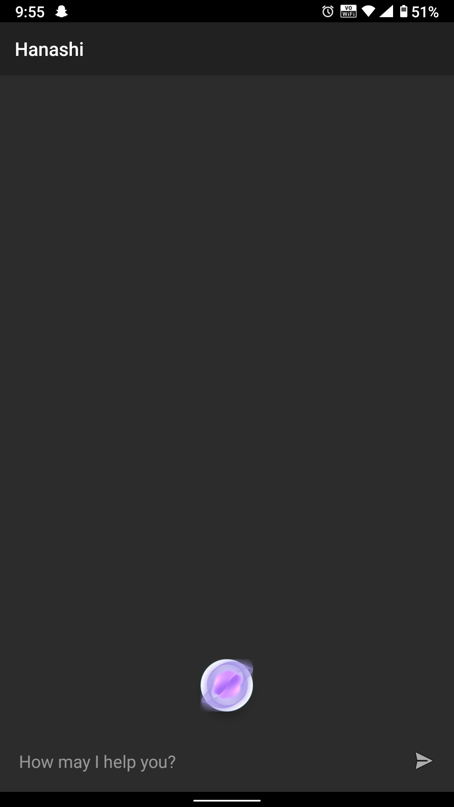
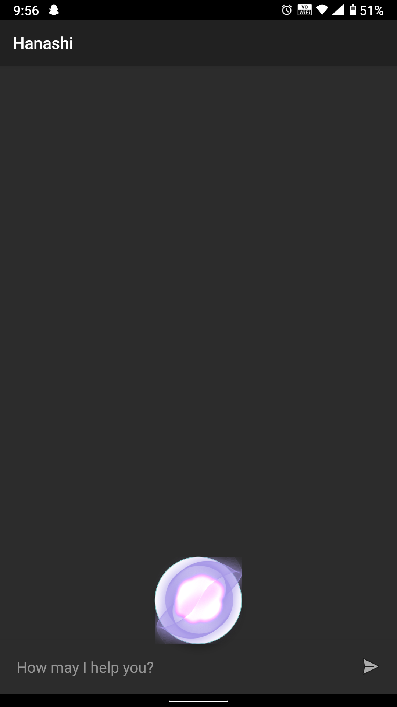
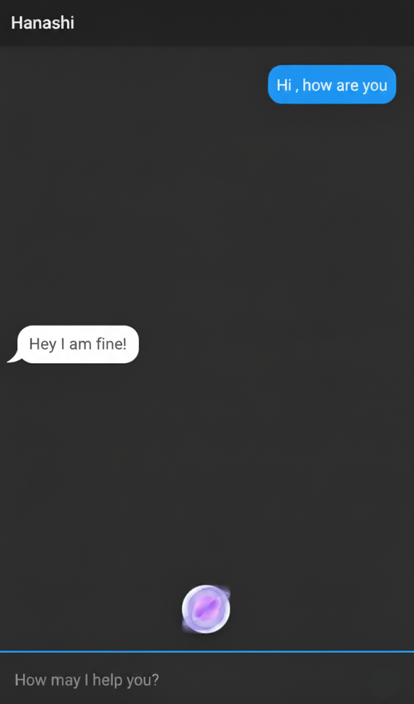
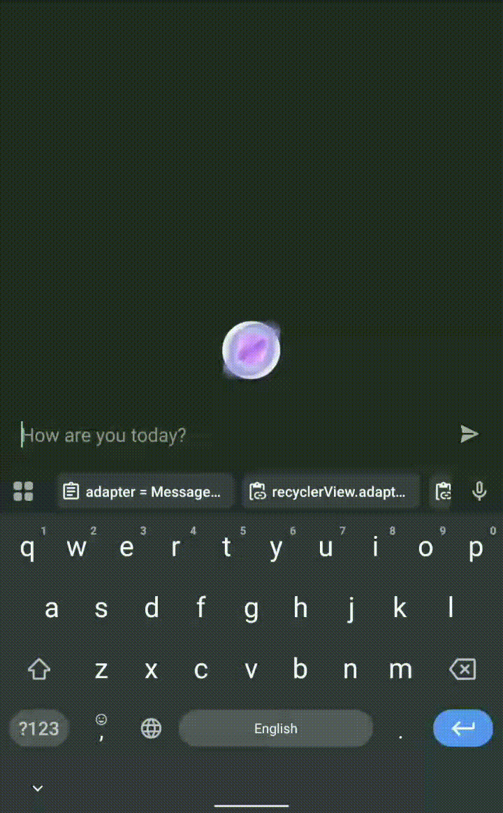
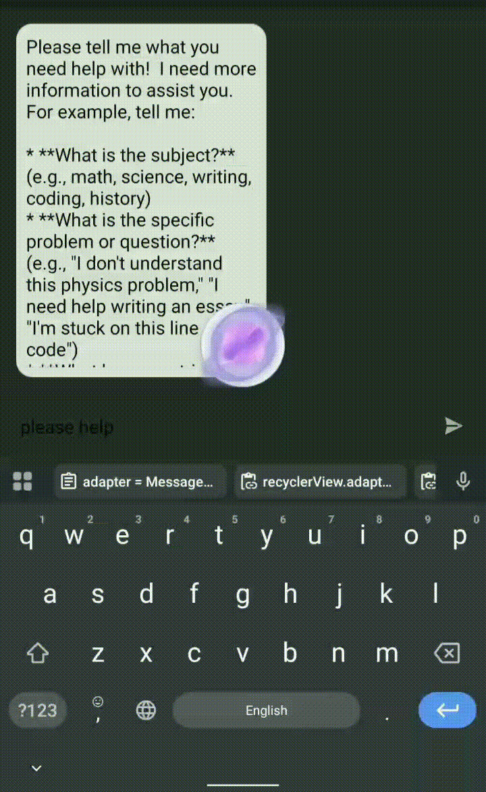

# AI Voice Assistant

An **AI-driven voice assistant** mobile application that allows users to interact via **text or speech**, powered by a **Flask backend** and **Google Gemini API**. The app provides intelligent responses and speaks them using Text-to-Speech (TTS).

---

## MAJOR UPDATE!

Once the **Hanashi App** is installed **Microphone permission** has to be manually set in the respective Android device

---

## Features

- **Text & Voice Input**: Users can type messages or speak directly using the microphone.  
- **Real-time Voice Response**: Bot replies are spoken aloud using TTS.  
- **Dynamic Chat Interface**: RecyclerView displays the conversation history.  
- **Backend AI Integration**: Flask server interacts with Google Gemini API.  
- **Special Date & Time Queries**: Automatically responds to date/time questions.  
- **Mic Animation**: Visual feedback while listening.  
- **Error Handling**: Alerts users if the backend is unreachable or responses are invalid.

---

## Tech Stack

- **Frontend**: Kotlin, Android Studio, RecyclerView, TTS, SpeechRecognizer  
- **Backend**: Python, Flask, Flask-CORS, Google Gemini API  
- **Networking**: OkHttp (HTTP requests)  
- **Hosting**: Render (Flask backend)

| Component      | Technology / Library          |
|----------------|-------------------------------|
| Frontend       | Kotlin, Android Studio        |
| Backend        | Python, Flask                 |
| AI Model       | Google Gemini API             |
| Networking     | OkHttp                        |
| Hosting        | Render                        |

---

## 📥 Download & Install

On clicking the link the app will get downloaded once "view raw " is clicked
👉 **[Download APK](App/Hanashi.apk)**  

### Installation steps:
1. Download the APK from the link above.  
2. Transfer it to your Android device (or open directly if downloaded there).  
3. Enable **Install from Unknown Sources** in device settings.  
4. Tap the APK to install.
5. Before opening the app give the **micrphone permission externally** 🎤
6. Open the app and your Assistant is at your assistance

---

## Screenshots / Demo


### Screenshots
     

### GIF (Animation Example)
   


---

## Getting Started

Follow these instructions to run the project locally.

### 1. Clone the Repository

```bash
git clone https://github.com/Suhas-2718/AI_Voice_Assistant.git
cd AI_Voice_Assistant
```

## 📌 Author

**Suhas Manjunatha**  
📫 [LinkedIn](https://www.linkedin.com/in/suhas-manjunatha21)  
🌐 [GitHub](https://github.com/Suhas-2718)

## 🌟 Show Your Support

If you liked this project, consider giving it a ⭐ on GitHub or sharing it with others!
